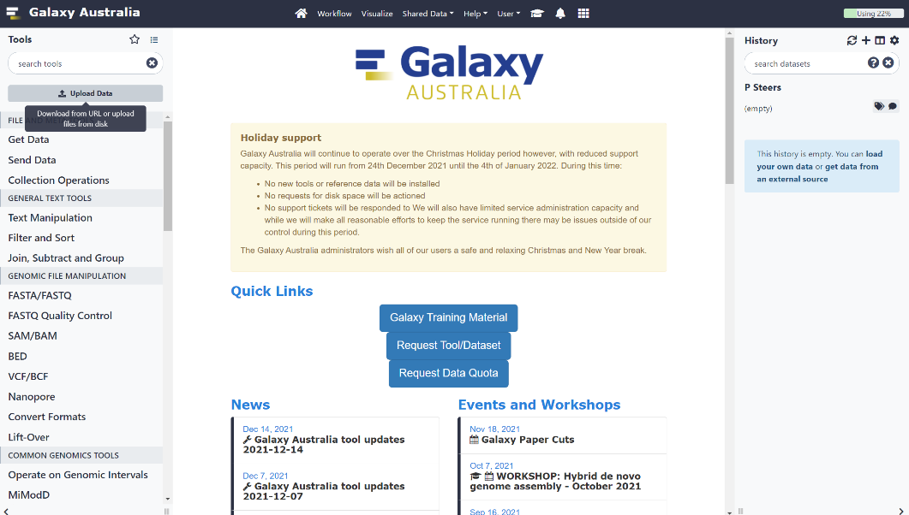
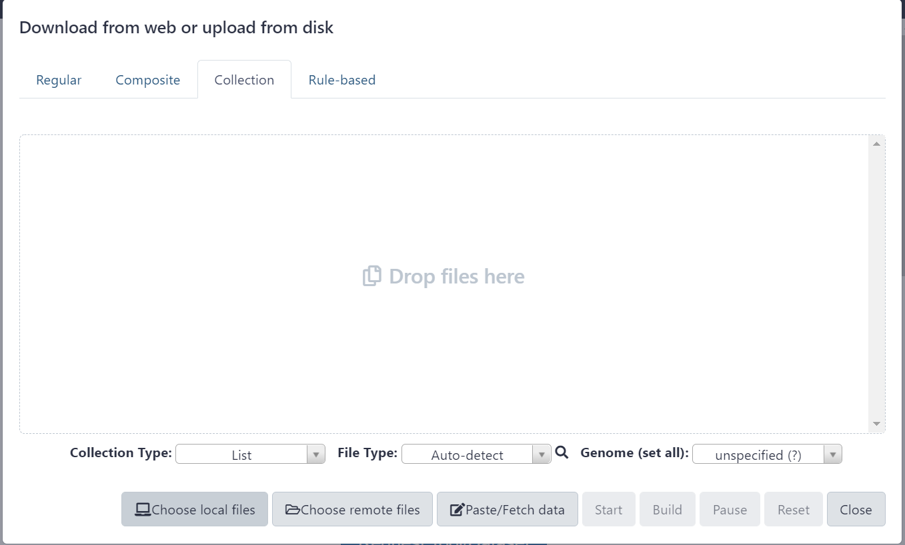
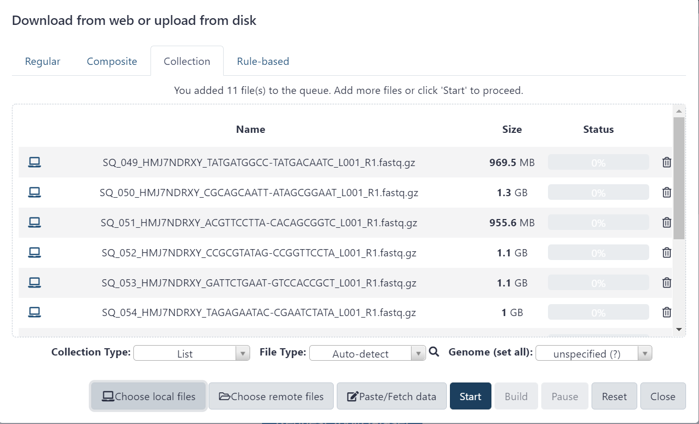
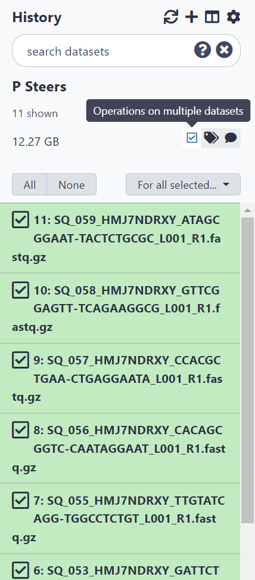
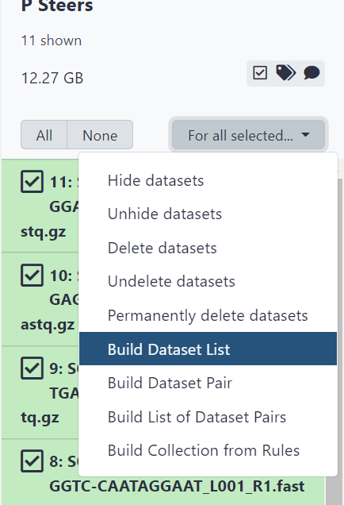
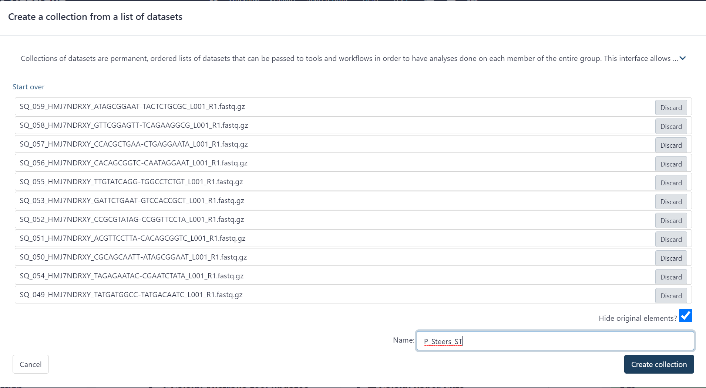
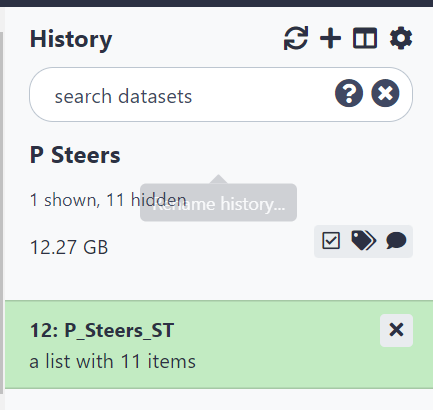
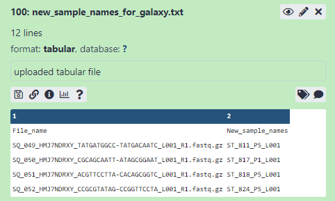
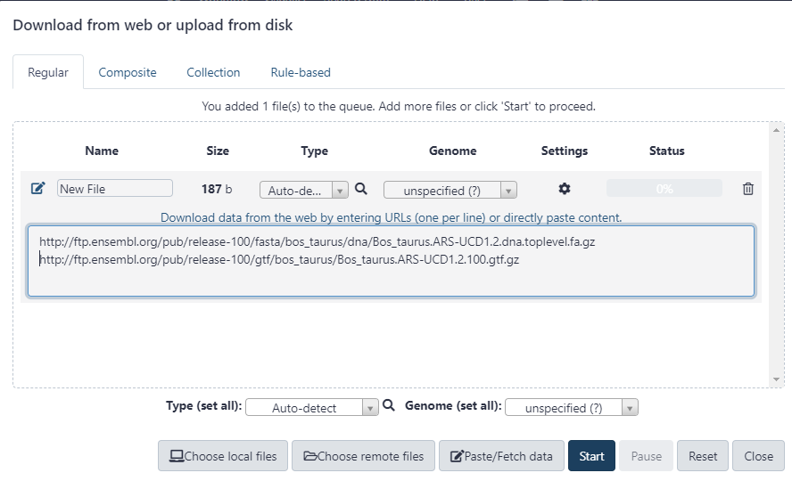
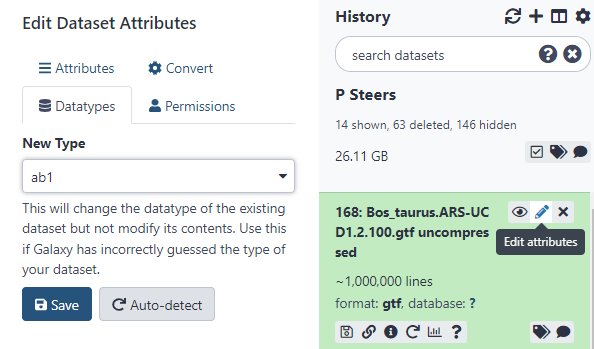

# Upload and Prepare Data

## Import fastq files
### Upload
Firstly we upload the files to the Galaxy History. Follow figures below.

```{r chunk1, echo = FALSE, out.width = '100%', fig.align='center', fig.cap='Click Upload Data button'}

```

```{r chunk2, echo = FALSE, out.width = '100%', fig.align='center', fig.cap="Select ‘Collection’ from the top ribbon and click ‘Choose local files’ button"}

```


```{r chunk3, echo = FALSE, out.width = '100%', fig.align='center', fig.cap="Navigate to the files to upload and highlight them all using Shift or Ctrl keys to help, then click ‘Open’"}
knitr::include_graphics("images/image003.png")
```

```{r chunk4, echo = FALSE, out.width = '100%', fig.align='center', fig.cap="Click ‘Start’ button to begin uploading files. Keep this website open until it is finished."}

```

### Add files to a 'collection'
Once the files have uploaded they will appear in the History pane. Next, we add them to a ‘collection’, which is basically just a list of files. It allows all files to be parsed through a workflow one by one. For example, if a tool was used on a collection, then each item in the list/collection would invoke its own job while all output is kept within a collection in the history.

```{r chunk5, echo = FALSE, fig.height=6, fig.align='center', fig.cap="Select ‘Operations on multiple datasets’ then select all items to add to collection"}

```

```{r chunk6, echo = FALSE, fig.align='center', fig.cap="Click ‘For all selected’ then 'Build dataset list'"}

```

```{r chunk7, echo = FALSE, out.width='100%', fig.align='center', fig.cap="Type a name for the list and click ‘Create collection’ button"}

```


```{r chunk8, echo = FALSE, fig.align='center', fig.cap="All files should now be in a collection in the History pane."}

```


## Rename Files {#rename-files}
This step renames the files to more meaningful and user friendly names.

To do this, a new file is imported with the old names and the new names. This should be a tab delimited .txt file with 2 columns of data. 

The 1st column has original name (which is likely to be filename) and the 2nd column has new names. E.g. original filename might be `SQ_049_HMJ7NDRXY_TATGATGGCC-TATGACAATC_L001_R1.fastq.gz` whereas new name could be changed to include treatment information such as `ST_811_P5_L001`.
It is important that the "_L" number is included at the end, even if there is not multiple lanes per sample. This will be dealt with by the "Step 1" workflow. See section \@ref(rename-note).

Use the 'upload data' feature of galaxy to import the .txt file to to the History. It should look something like \@ref(fig:example-rename).


```{r example-rename, out.width = '100%', echo = FALSE, fig.align='center', fig.cap="Example of text file imported to History with original and new filenames"}

```


This .txt file can be made in Excel, or it can be done much quicker using a simple R script. The following is an example script:
```{r example-script, eval=FALSE}
# list file names and create table with new file names for use in galaxy's "Relabel list identifiers" tool
library(tidyverse)
library(data.table)

#list the names of the fastq files in the working directory
file_list <- list.files(path = "E:/RNAseq - P steers ST 20211212/", pattern = ".fastq")

#list .csv files to select the .csv file that contains sample information
files_csv <- list.files(path = "E:/RNAseq - P steers ST 20211212/", pattern = ".csv")

#selects the correct .csv file, in this case there is only 1 file anyway, but the correct file can be selected by entering it's number in the list in the []
selected_file <- files_csv[1]
message(paste("Selected file -", selected_file))

#import the selected file, making sure no columns have the same name
sample_IDs <- fread(file = paste0("E:/RNAseq - P steers ST 20211212/",selected_file)) %>% 
  as_tibble(.name_repair = "unique") %>% 
  mutate(`Steer ID` = as.character(`Steer ID`)) 


#As the file names have a set structure, it can be split by the _ character
df_file_names_split <- str_split(file_list, pattern = "_", simplify = TRUE) %>% as.data.frame()

#In this example, the 'key' column is the RNAseq_ID column. So this will be modified to remove the 'SQ_' from the ID so that it can match.
sample_IDs <- 
  sample_IDs %>% 
  mutate(RNAseq_ID_2 = str_remove(RNAseq_ID, "SQ_"),
         Treatment2 = str_remove(Treatment, '-'))

#join the sampleID annotations to this dataframe, concat required columns for new name
new_names <- df_file_names_split %>% 
  left_join(sample_IDs, by = c("V2" = "RNAseq_ID_2")) %>% 
  mutate(new_sample_names = str_c(`Tissue type`,`Steer ID`, Treatment2, V5, sep = "_")) %>% #make new names with ID_Treatmentinfo_Lane
  magrittr::use_series(new_sample_names) #select only the required column as a list (not a table)

#create new table with only old file names and new names
new_name_table <-
  data.frame("File_name" = file_list, "New_sample_names" = new_names)

#export to working directory, as tab delim 
fwrite(new_name_table, file = "E:/RNAseq - P steers ST 20211212/new_sample_names_for_galaxy.txt", sep = "\t")

 

```

### A note on multiple lanes {#rename-note}
The output from Illumina sequencing is sometimes provided in multiple files, each corresponding to a ‘Lane’ on the sequencer. It would be easier to ask the lab to provide the output as a single file, which can be computed using the `--no-lane-splitting` option from Illumina's `bcl2fastq` program. However, it can also be handled in Galaxy. If there are multiple files, it is best practice to run FastQC on each individual file, as there is a chance that one file could be corrupt or you may identify a bias for one particular ‘Lane’. If they are ok, then these files can be concatenated together before proceeding with all further steps. 

This is described further in Chapter \@ref(multiple-lane-files). Make sure the new names generated in Section \@ref(rename-files) have a format that includes "_L". The protocol relies on there being a ‘_L’ in the name for it to find the lane number. The rest of the name before the ‘_L’ should be the same.

E.g. the following three files would be concatenated together by the "Step 1" workflow: 

-	2139_Stage 2_Fast_L008
-	2139_Stage 2_Fast_L007
-	2139_Stage 2_Fast_L006


## Import ENSEMBL files
In this step we need to import the required fastq file for sequence alignment and a gtf file for gene annotation. 
These can be uploaded directly to Galaxy via a URL. To find the required files, navigate to [http://ftp.ensembl.org](http://ftp.ensembl.org) in a browser.

For sheep (ovis_aries) these might be:

- http://ftp.ensembl.org/pub/release-100/fasta/ovis_aries/dna/Ovis_aries.Oar_v3.1.dna.toplevel.fa.gz
- http://ftp.ensembl.org/pub/release-100/gtf/ovis_aries/Ovis_aries.Oar_v3.1.100.gtf.gz

For cattle (bos_taurus) these might be:

- http://ftp.ensembl.org/pub/release-100/fasta/bos_taurus/dna/Bos_taurus.ARS-UCD1.2.dna.toplevel.fa.gz
- http://ftp.ensembl.org/pub/release-100/gtf/bos_taurus/Bos_taurus.ARS-UCD1.2.100.gtf.gz

Note that unmasked files are used here (i.e. use files without `_rm` or `_sm`).

To upload these to Galaxy, use the 'Paste/Fetch data' button in the 'Upload data' dialogue box on Galaxy.
```{r paste-url, out.width = '100%', echo = FALSE, fig.align='center', fig.cap="Paste each URL on a new line to upload directly from ENSEMBL to Galaxy."}

```

Once executed, 2 new files will appear in the History, each named as the URL entered. This can take some time to finish as they are large files.

### Uncompress .gtf file
These files are actually .gz files, which means they are compressed. Normally, this is automatically handled by Galaxy but does not currently work for the .gtf file when using it with the `STAR Aligner` in this workflow. Therefore, use the tool [https://usegalaxy.org.au/root?tool_id=CONVERTER_gz_to_uncompressed](https://usegalaxy.org.au/root?tool_id=CONVERTER_gz_to_uncompressed) to uncompress the .gtf file before proceeding.

Once it is uncompressed it may not have the correct file format attributed to it in Galaxy. Fix this by using the auto-detect feature within the Datatypes ribbon of the Edit Attributes section.

```{r edit-attributes, out.width = '100%', echo = FALSE, fig.align='center', fig.cap="Click 'edit attributes' then navigate to 'Datatypes' to use the Auto-Detect. Otherwise manually set it to .gtf"}

```
