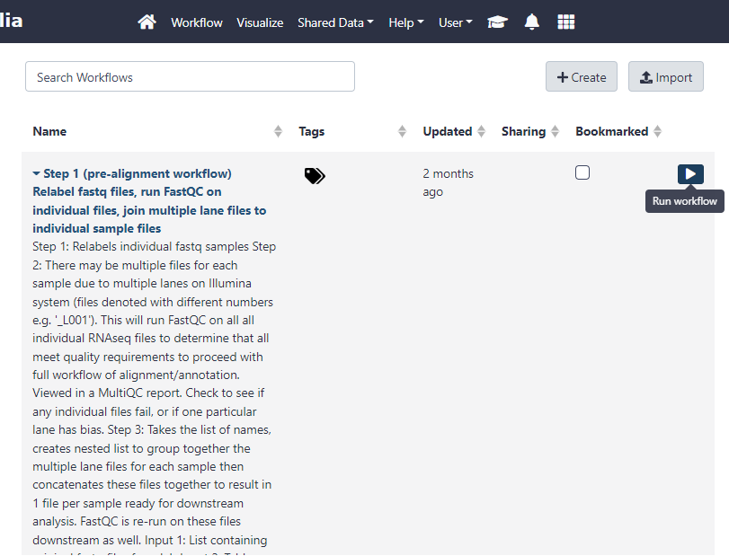
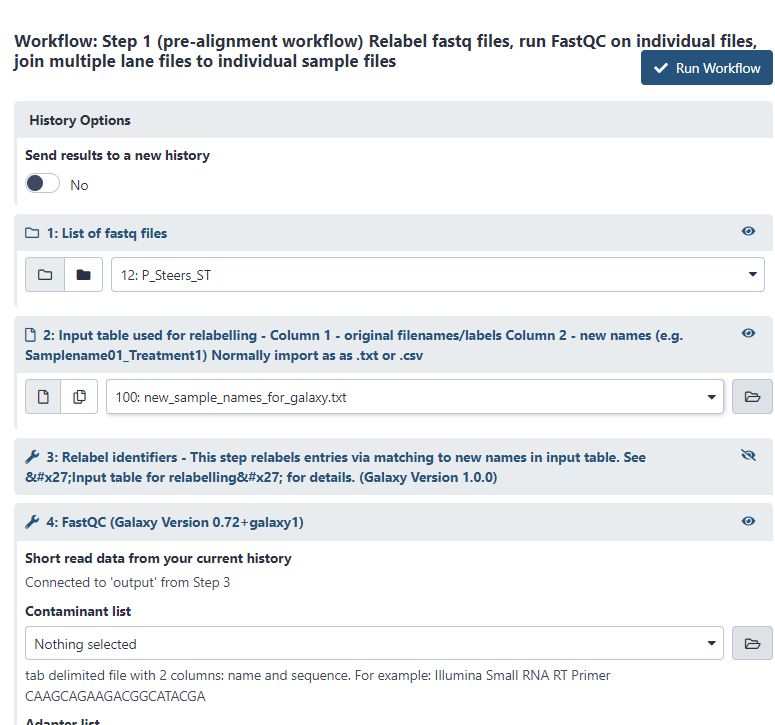
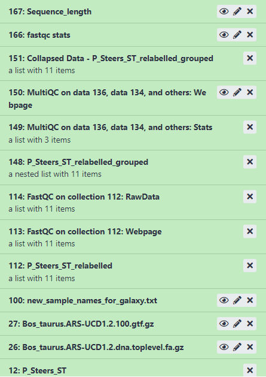
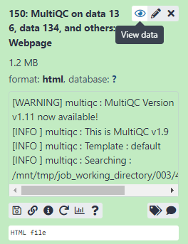

# Workflow - Step 1 {#step1}
Once all of the data is uploaded to Galaxy it is time to run/invoke the workflows.
The first workflow is relatively fast compared to Step 2, but is important for QC and to prepare data.

## Find workflow
The workflow used here is published at: https://usegalaxy.org.au/u/dave-innes/w/rna-seq-step-1

This workflow will need to be imported into your personal galaxy profile. Navigate to: https://usegalaxy.org.au/workflows/import
On this page you will be able to enter the workflow URL above. This will also be required for Step 2.

You can also navigate directly the workflow's URL and import it from there. 

## Run workflow
To view your workflows, click on the 'Workflow' link at the top of the page.

```{r view-workflow, echo = FALSE, out.width='100%', fig.align='center', fig.cap="Click the Run Workflow button"}

```

Once you've clicked 'Run Workflow' it will let you select the files it should use and show all of the steps it will complete.
Select the appropriate files for 1 and 2. All other steps will not require user input.

```{r run-workflow, echo = FALSE, out.width='100%', fig.align='center', fig.cap="Select list of fastq files for number 1 and select the table of new names for number 2, then click 'Run Workflow'"}

```

This will invoke all steps and you will see them in the History.

## View results
Once all steps are completed you will see the each part of the History has turned green.

```{r history-post-step1, echo = FALSE, fig.align='center', fig.cap="Example output in history after running first workflow"}

```

The most interesting data will be found in the MultiQC webpage. It can be Viewed within galaxy but it may view better if downloaded and opened up in web browser.
```{r view-multiQC, echo = FALSE, fig.align='center', fig.cap="View the MultiQC webpage report"}

```


There is plenty of help included in the report and it is worth noting that some sections will normally fail for RNAseq data. Although unlikely, it is also important to check if there are any major quality differences between lanes before proceeding (if multiple lanes exist).

